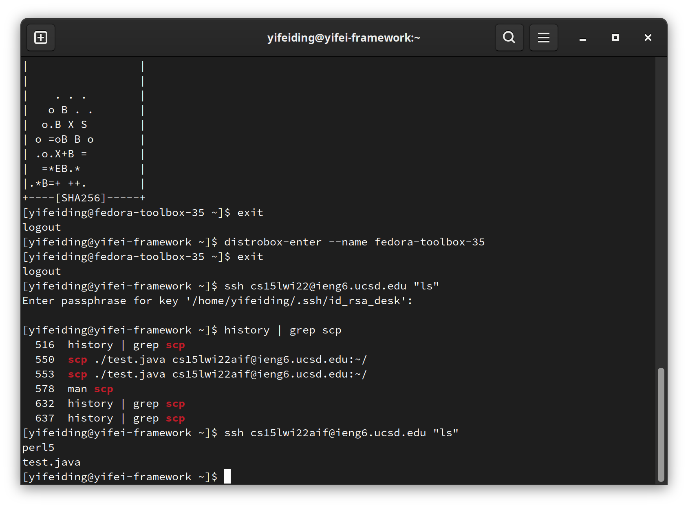

# Week 2 Lab Report

These steps will take you through the process for connecting to the eng6 remote
machine.

Note: I used Fedora on my PC so everything is Linux based.

## Installing VScode

To install VSCode, follow the [setup guide](https://code.visualstudio.com/docs/setup):

Add VSC repository

```bash
sudo rpm --import https://packages.microsoft.com/keys/microsoft.asc
sudo sh -c 'echo -e "[code]\nname=Visual Studio Code\nbaseurl=https://packages.microsoft.com/yumrepos/vscode\nenabled=1\ngpgcheck=1\ngpgkey=https://packages.microsoft.com/keys/microsoft.asc" > /etc/yum.repos.d/vscode.repo'
```

Install VSC:

```bash
dnf check-update
sudo dnf install code
```

Run VSC from command line or Application Launcher:

```bash
code
```

If the installation is successful, VSCode will launch.


## Remotely Connecting

Navigate to the top bar element *Terminal* and choose *New Terminal*. It will
open a terminal at the bottom, where you can connect to the remote machine by
using the following command:

```bash
ssh cs15lwi22<xxx>@ieng6.ucsd.edu
```

You need to type in the password, and the prefix of the terminal will change
indicating you are in the remote server.


## Trying Some Commands

Try some commans, for example, `man ls` and `ls -al`.

`man ls` will give you the manual of the command `ls` and `ls -al` displays the
files at the current directory.


## Moving Files with scp

`scp` copies the file on the current system to the remote system. The manual
explains its function. Run it on the local machine and copy a dummy java file
to remote:

```
touch test.java # Create file
scp ./test.java cs15lwi22aif@ieng6.ucsd.edu:~/
```

You can verify it's present in remote by running `ls` at the home directory:


## Setting an SSH Key

Use `ssh-keygen` to generate the key. After it's generated, use `ssh-copy-id` in
place of the regular `ssh` command to copy the public key to remote server.


Now `ssh` into the remote server again. It will no longer require password on your
machine.

## Optimizing Remote Running

You can directly run command on remote server by running the following:

```bash
ssh cs15lwi22<xxx>@ieng6.ucsd.edu "<command>"
```

run multiple commands by using `;` inside the double quote to separate commands.

