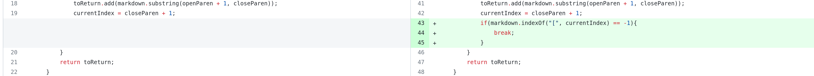
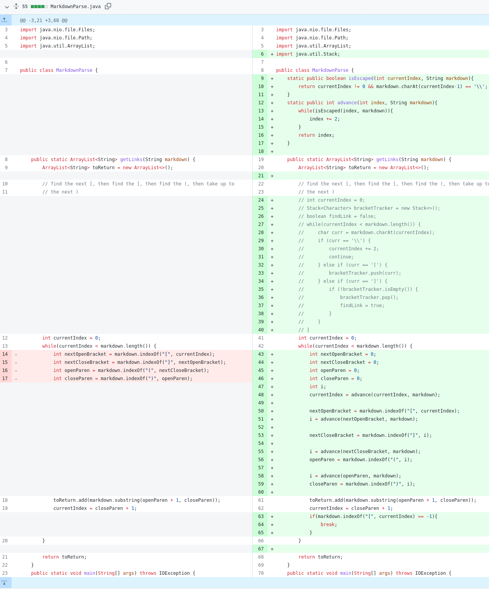
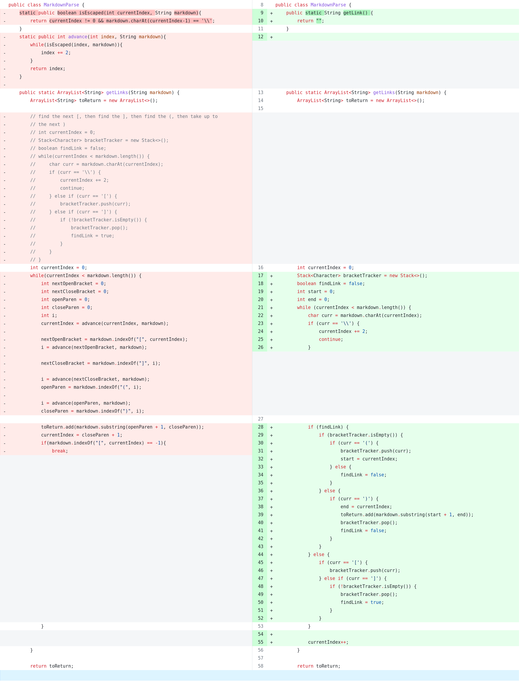
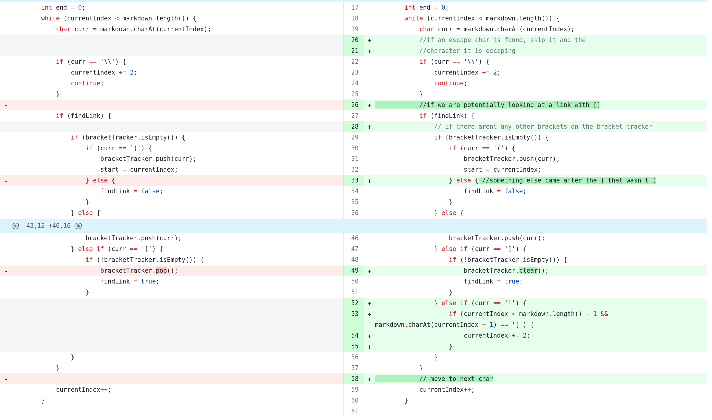

# Week 4 Lab Report 2

## Code Change 1

The following change was introduced:



Test file link:

[File](https://github.com/JessalynWang/markdown-parse/blob/main/Group-test-file2.md)

Output(No output and the program does not exit):

```bash
[yifeiding@yifei-framework markdown-parse]$ java ./MarkdownParse.java './Group-test-file2.md' 
```

Expected Output:

```
[https://google.com]
```

The bug is caused by the return value of -1 when the loop iterated to the end of the file and no more link symbols can be found. Thus the program can only exit when the
file is ended with a link. Our failure-inducing input ended the file with a non-link line.
The bug caused a infinite loop, which is symptom we observed
(namely program stuck). The fix work by exiting when return value indicates we can't find more links.


## Code Change 2

The following change was introduced:



Test file link:

[File](https://github.com/JessalynWang/markdown-parse/blob/main/Group-test-file3.md)

Output(the real link is skipped)

```bash
[yifeiding@yifei-framework markdown-parse]$ java ./MarkdownParse.java './Group-test-file3.md'
[\] 
```

Expected Output: 

```
[this is a link]
```

The symptom appear to be recognizing the fake link which the escape characters had escaped. The input file contains a fake link inside the link text. 
This symptom is caused by the link detection loop, where the bug is the lack of
escape character recognition.

## Code Change 3

The following change were introduced (A rewrite and a fix):




 
Test file link:

[File](https://github.com/JessalynWang/markdown-parse/blob/main/test-file6.md)

Output:

```
[yifeiding@yifei-framework markdown-parse]$ java ./MarkdownParse.java './test-file6.md'
[page.com]
```

Expected output:

```
[]
```

The symptom is an image link is being added to the list of links. Where when we have a
file with image (``), the `link` is outputted. The bug is a lack of
detection for images (namely the `!` before the link). 