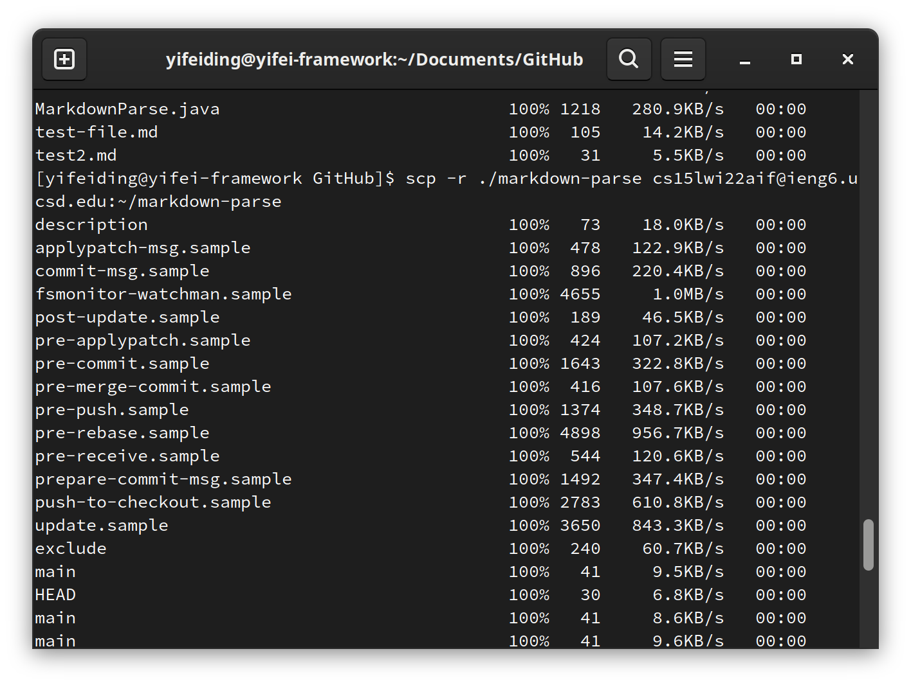

# Week 6 Lab Report 3

## Copy Whole Directory With `scp -r`

The parameter `-r` for scp command copy recursively, the `scp` manual page states:`     -r      Recursively copy entire directories.  Note that scp follows symbolic links encountered in the tree traversal.`

### Copy markdown-parse to ieng6

Use the following command to copy markdown-parse directory to the remote server:

```bash
scp -r ./markdown-parse cs15lwi22aif@ieng6.ucsd.edu:~/markdown-parse
```

The command above assume we are in the GitHub folder, if we are in the markdown-parse folder, we can just use `.`.

The output would be similar to tho following:



### Logging into ieng6 and execute the tests:

Indeed the files are copied, we are able to run `make test` in markdown-parse:


### Combine two into one line and exclude the .class files

Since we also copied the class files, the class files' last modified would stop `make` from compiling the file again. Add `rm *.class` to remove all the class files present to ensure we have a fresh build. The resulting command is

```bash
scp -r . cs15lwi22aif@ieng6.ucsd.edu:~/markdown-parse && ssh cs15lwi22aif@ieng6.ucsd.edu "cd markdown-parse ; rm *.class ; make test"
```

